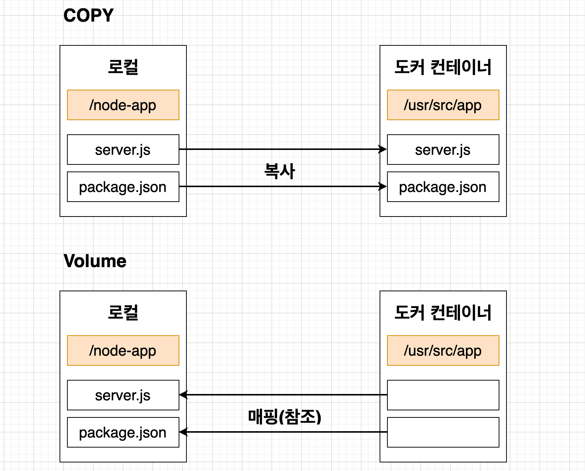

# 간단한 어플을 실제로 배포해보기(개발 환경)

## 목차

- [개요](#개요)
- [도커파일 생성](#도커파일-생성)
- [도커파일 빌드](#도커파일-빌드)
- [이미지 실행](#이미지-실행)

- [Volume 적용](#Volume-적용)

<br>

---


## 개요


<br>

---

##  도커파일 생성

```dockerfile
FROM node:alpine

WORKDIR /usr/src/app

# package.json가 수정되지 않은 경우 불필요한 install을 계속 하게됨
COPY package.json ./

RUN npm install

COPY ./ ./

CMD ["npm", "run", "start"]
```

<br>

---

## 도커파일 빌드

보통은 기본적으로 `Dockerfile`을 찾는데 이름이 다를 경우 아래 명령어로 빌드시키면 된다.

```sh
docker build -f Dockerfile.dev -t song7331/docker-react-app ./
```


**Tip**

- 빌드전 로컬에 `node_modules` 폴더가 있다면 지우고 `Dockerfile`을 빌드하는게 좋다
  -  `RUN` 단계에서 생성됨(불필요한 `COPY` 방지)

<br>

---

## 이미지 실행


```bash
docker run -p 3000:3000 song7331/docker-react-app
# 실습할 떈 -it 안붙여도 실행 가능했음
```


<br>

---

## Volume 적용

**COPY대신 VOLUME을 이용하면 소스를 변경했을 때 다시 이미지를 빌드하지 않아도 변경한 소스 부분이 애플리케이션에 반영된다.**




```bash
docker run -p 3000:3000 -v /usr/src/app/node_modules -v $(pwd):/usr/src/app song7331/docker-react-app
```

이렇게 실행하면 로컬 소스코드에서 변경된게 페이지에도 바로 반영된다.

<br>

---

